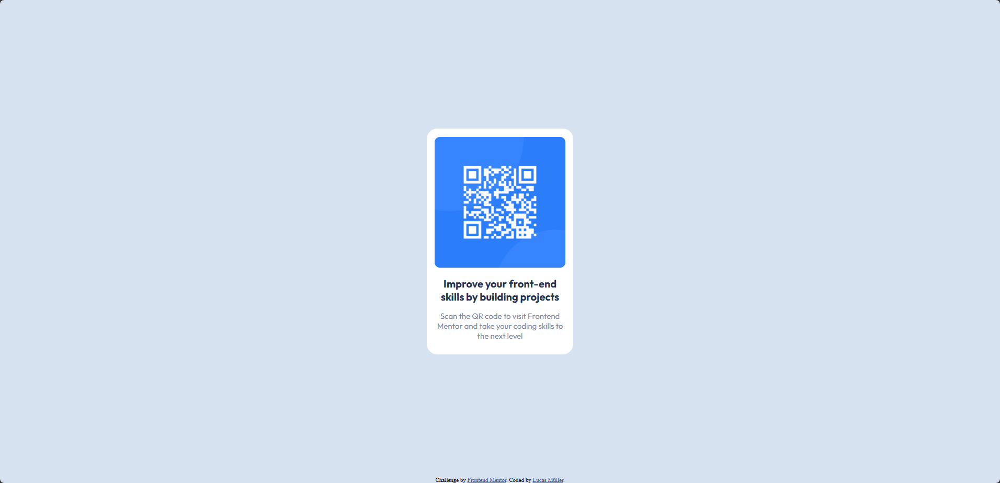
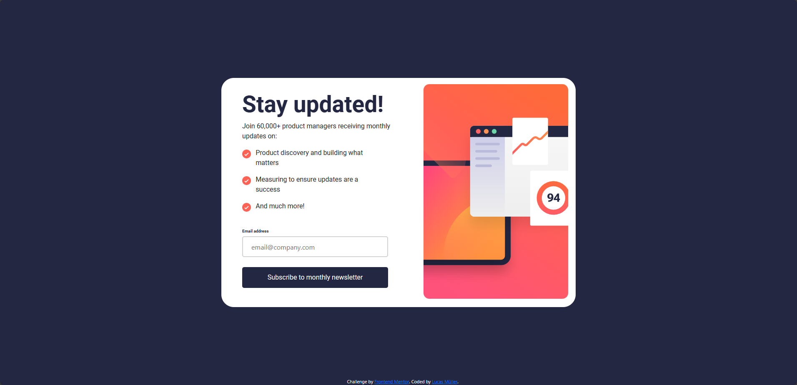
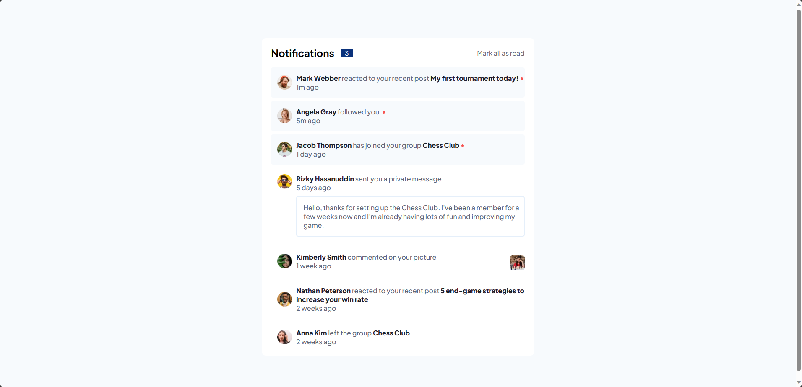

# 
#### Diverse Frontend Mentor projects showcasing my coding journey. Exploring responsive designs & interactive features. Learning & growing one project at a time. 🚀

  

# Projects
## Newbie
* <strong>[QR code component using Flexbox](https://www.frontendmentor.io/solutions/qr-code-component-using-flexbox-Leo8moyCcL)</strong>
  * Screenshot
  
  * [Live Website](https://frontend-mentor-projects-lucasmullerc.vercel.app/)

## Junior
* <strong>[Newsletter sign-up form with success message using Bootstrap](https://www.frontendmentor.io/solutions/newsletter-signup-form-with-success-message-using-bootstrap-r48ASfVZ9-)</strong>
  * Screenshot
  
  * [Live Website](https://newsletter-sign-up-one-mu.vercel.app/)

* <strong>[Notifications page using Angular](https://www.frontendmentor.io/solutions/notifications-page-using-angular-CsbVNXy5uy)</strong>
  * Screenshot
  
  * [Live Website](https://frontend-mentor-projects-s75l.vercel.app/)